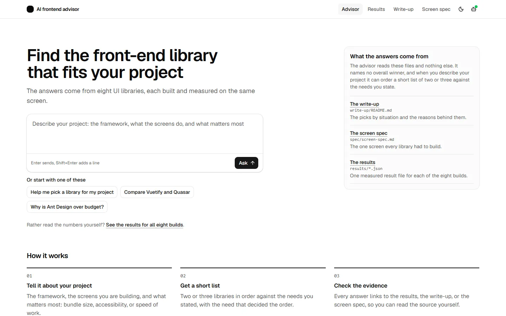
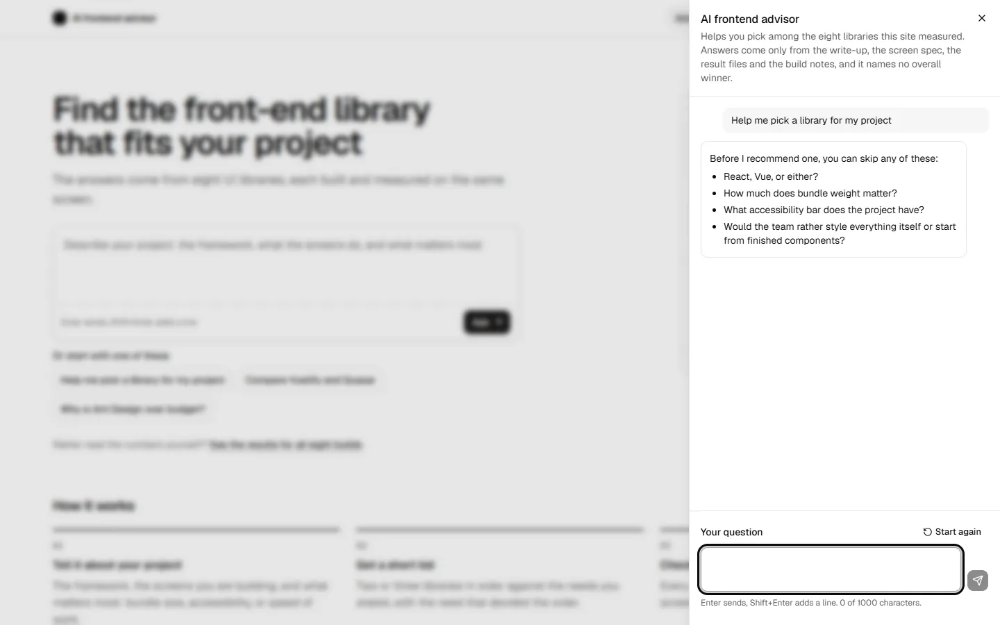
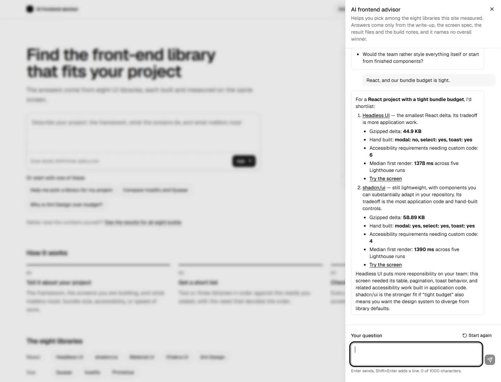
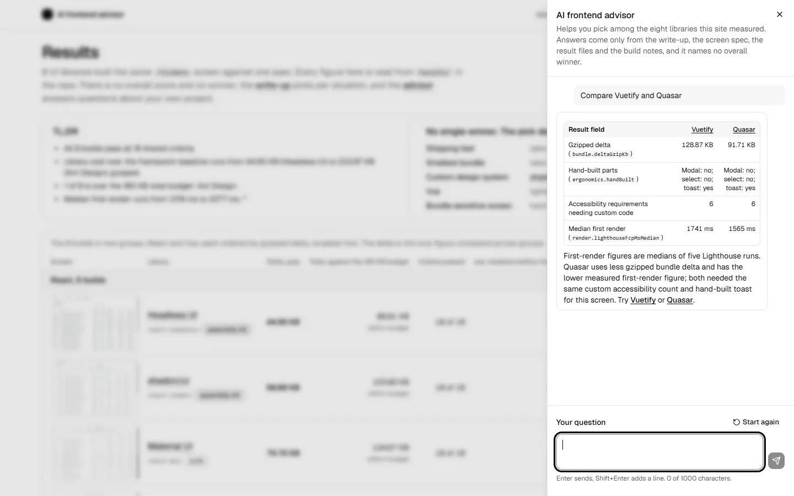
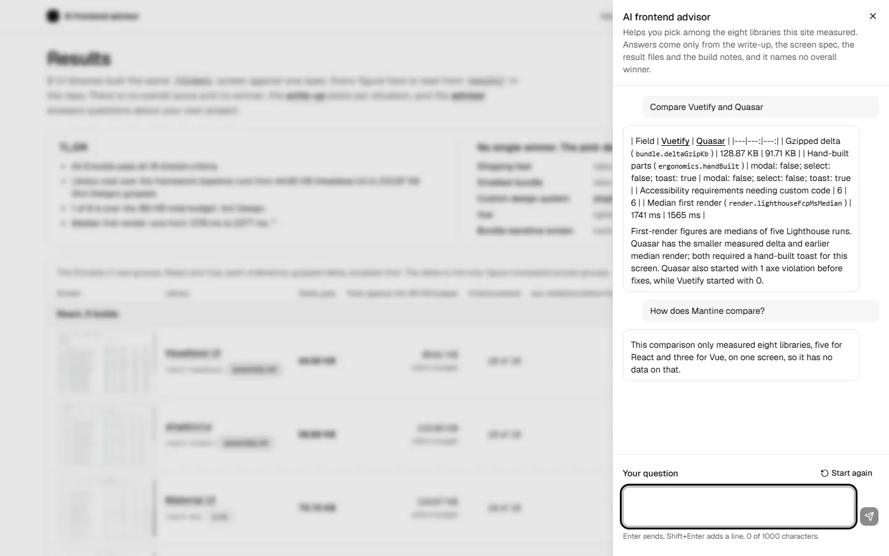
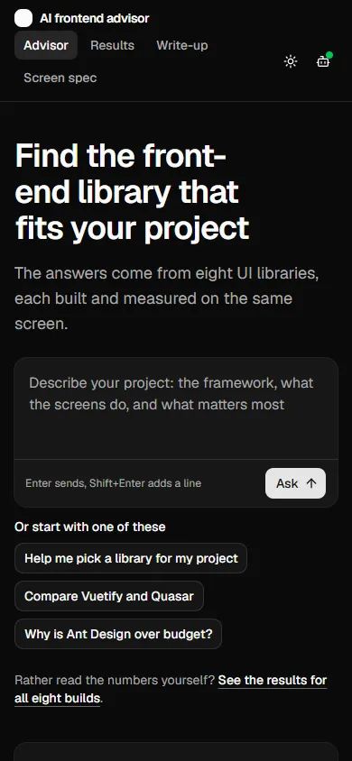

# AI frontend advisor

An AI chat that helps you pick a front-end UI library for your project. Its answers come from a controlled comparison: eight libraries each built the same `/tickets` screen, and every build was measured the same way for bundle size, accessibility defaults, ergonomics and first render.

Try it at [ai-frontend-advisor.bobdempsey83.com](https://ai-frontend-advisor.bobdempsey83.com).



## What the advisor does

- **Asks about your project.** Say "help me pick a library" and it asks up to four questions in one message: React, Vue or either, how much bundle weight matters, your accessibility bar, and whether your team styles everything itself or wants finished components. You can skip any of them.
- **Gives you a short list.** It names two or three libraries in order. Each pick comes with its gzipped bundle cost, the parts the build had to make by hand, how many accessibility requirements needed custom code, and its median first render, plus one line on which of your needs put it there.
- **Explains trades.** Ask why Ant Design is over budget and it names the cause: its `Table` pulls in `rc-virtual-list`.
- **Compares two libraries** in a table. A React library and a Vue library are compared on bundle cost only, since each is measured against its own framework's empty app.
- **Warns about known problems**, such as PrimeVue switching to dark mode with the operating system unless that option is turned off.
- **Links to the evidence**: each pick's build page and its live demo.
- **Says when the data runs out.** Ask about a library outside the eight, another framework, screen reader behavior or server rendering, and it says the comparison did not measure that, with no figures.

It never names an overall winner and never ranks all eight.






## What you can do on the site

- **Ask from the landing page.** Type a question or click a starting prompt, and the advisor opens in a side drawer with the answer.
- **Keep asking from any page.** The robot button in the navbar opens the same drawer on the results, write-up, spec and build pages. Your conversation follows you between pages in the same tab and clears when you close it. Each visitor gets 20 questions every 10 minutes.
- **Check the numbers** on [`/results/`](https://ai-frontend-advisor.bobdempsey83.com/results/): the scoreboard, its charts and a short summary.
- **Read the method** in the [write-up](https://ai-frontend-advisor.bobdempsey83.com/write-up/) and the [screen spec](https://ai-frontend-advisor.bobdempsey83.com/spec/).
- **Try the live demos.** Each is a working tickets screen you can search, filter, sort, page through and edit: [Headless UI](https://ai-frontend-advisor.bobdempsey83.com/screens/react-headless/), [shadcn/ui](https://ai-frontend-advisor.bobdempsey83.com/screens/react-shadcn/), [Material UI](https://ai-frontend-advisor.bobdempsey83.com/screens/react-mui/), [Quasar](https://ai-frontend-advisor.bobdempsey83.com/screens/vue-quasar/), [Chakra UI](https://ai-frontend-advisor.bobdempsey83.com/screens/react-chakra/), [Vuetify](https://ai-frontend-advisor.bobdempsey83.com/screens/vue-vuetify/), [PrimeVue](https://ai-frontend-advisor.bobdempsey83.com/screens/vue-primevue/), and [Ant Design](https://ai-frontend-advisor.bobdempsey83.com/screens/react-antd/).



## How the AI works

- **Model.** OpenAI's `gpt-5.6-luna`, called from a Vercel Function ([`api/chat.ts`](api/chat.ts)), so the key never reaches the browser.
- **Grounding.** The system prompt carries the write-up, the screen spec, the eight result files, the library list and [`advisor/notes.md`](advisor/notes.md). Every figure the advisor quotes comes from those files, and a test fails if the notes hold a figure the results and write-up do not.
- **Eval.** `pnpm advisor:eval` asks the live model 12 fixed questions. A reply fails if it quotes a figure missing from the grounding, names a winner, lists more than three picks, or skips the limits answer when the question goes past the data. The latest run passed all 12.
- **Guardrails.** Requests from other sites are refused. A Vercel Firewall rule allows each visitor 20 questions per 10 minutes, and a monthly spend cap on the OpenAI project limits total cost.
- **Loading.** Each page loads a 2.4 KB script, and the chat itself downloads the first time you hover, focus or click the button.

## How the comparison works

Eight UI libraries build the same `/tickets` screen, so they can be compared on ergonomics, bundle size, and accessibility defaults. The spec in [`spec/screen-spec.md`](spec/screen-spec.md) is the fixed input, and a library that cannot meet a requirement fails it rather than changing it.

This is sample content for a demo. The domain, the data, and the numbers are fictional.

## Results

All eight builds pass all 18 acceptance criteria. Sorted by bundle cost.

| Library | Framework | Kind | Delta gzip | Total gzip | Median FCP | Custom code | Hand built |
| --- | --- | --- | --- | --- | --- | --- | --- |
| Headless UI | React | assembly kit | 44.90 KB | 89.81 KB | 1378 ms | 6 | select, toast |
| shadcn/ui | React | assembly kit | 58.89 KB | 103.80 KB | 1390 ms | 4 | modal, select, toast |
| Material UI | React | suite | 79.76 KB | 124.67 KB | 1526 ms | 3 | toast |
| Quasar | Vue | suite | 91.71 KB | 115.92 KB | 1565 ms | 6 | toast |
| Chakra UI | React | suite | 97.81 KB | 142.72 KB | 1653 ms | 4 | none |
| Vuetify | Vue | suite | 128.87 KB | 153.08 KB | 1741 ms | 6 | toast |
| PrimeVue | Vue | suite | 150.20 KB | 174.41 KB | 1745 ms | 4 | toast |
| Ant Design | React | suite | 233.87 KB | 278.78 KB | 2277 ms | 5 | toast |

Delta is the total minus an empty app on the same framework, 44.91 KB for React and 24.21 KB for Vue, and it is the number the comparison is about. The 240 fixture rows load through a dynamic import and are excluded, as section 10 of the spec requires. Median FCP is Lighthouse first contentful paint, median of five runs against the deployed demos, written by `pnpm lighthouse --url` and read back by `pnpm measure`. Custom code counts how many of section 9's accessibility requirements the library did not supply.

Ant Design is the only build over the 180 KB budget. Its `Table` alone costs roughly 247 KB gzip with React, because `rc-table` pulls in `rc-virtual-list` unconditionally. That is a library weight finding, not an implementation shortfall.

Seven of the eight reported zero axe violations before any fix. Quasar had one, a double-nested `<label>` around `QInput`, since fixed. All results are machine written into [`results/`](results/) by `pnpm measure`.

Two differences are recorded rather than normalized: badge label casing varies by library, and only shadcn/ui renders a visible page heading. Both are library defaults showing through, which is what the comparison exists to measure.

## Layout

| Path | What it holds |
| --- | --- |
| `spec/screen-spec.md` | the spec, sections 1 to 13 |
| `packages/fixture` | 240 tickets from a seeded generator, committed as `tickets.json` |
| `packages/criteria` | the 18 acceptance criteria, shared by every build |
| `packages/harness` | the `ComparisonAdapter` interface and the 180 KB budget |
| `builds/*` | the eight implementations |
| `baselines/*` | an empty React and Vue app, the floor each delta subtracts |
| `results/*.json` | one scored result per build |
| `write-up/README.md` | the article |
| `site/` | the site: React and shadcn/ui rendered to static HTML at build time, specified in `spec/site-spec.md` |
| `api/` | the advisor's Vercel Function and its tests, specified in `spec/advisor-spec.md` |
| `advisor/notes.md` | known problems and fixes per build, part of what the advisor answers from |
| `scripts/` | scaffolding, scoring, Lighthouse, screenshots, and the site's screens build and browser checks |

## Commands

```
pnpm install
pnpm build               # all ten apps
pnpm test                # the 18 criteria in every build
pnpm lighthouse --all --url https://ai-frontend-advisor.bobdempsey83.com
                         # first contentful paint, five runs per deployed build
pnpm typecheck           # the three shared packages and the site
pnpm lint                # Biome lint over builds/, report only
pnpm format:check        # Biome format check over builds/, report only
pnpm measure --all       # rescore every build into results/
pnpm fixture:check       # check what the criteria assume about the fixture
pnpm fixture:generate    # regenerate the 240 tickets, then check them
```

The results site builds and checks with its own root scripts:

```
pnpm site:build          # site/dist, one static HTML file per view
pnpm site:screens        # rebuild the eight apps under site/dist/screens/ (run after site:build)
pnpm site:check          # axe, keyboard, fold, theme, and screen checks in Chrome
pnpm dev                 # the site on http://localhost:5190, chat included (key from .env.local)
pnpm test:api            # the advisor function's Vitest suite
pnpm advisor:eval        # 12 questions against the live model, by hand (spends OpenAI credit)
pnpm screenshots --all   # recapture the sixteen committed screenshots, by hand
```

Vercel builds the site from `main` on every push, using `vercel.json`. The advisor page and the scoreboard follow the reader's system color scheme and have a light and dark toggle in the navbar; every other page stays light.

`tickets.json` is committed and the seed is fixed, so regenerating produces the same file. If it does not, the earlier bundle numbers stop comparing and the run starts over.

Each build serves on its own port, 5173 through 5180 in roster order, so all eight can run at once: `pnpm --filter @uilc/<build> dev`.

The full article, with the method, the fixture generator, and the reasoning behind each number, is in [`write-up/README.md`](write-up/README.md).

## Working on this

The rules that keep the comparison valid are in [`CLAUDE.md`](CLAUDE.md). The fuller state, the decisions, and the known gaps are in [`handoff.md`](handoff.md).
